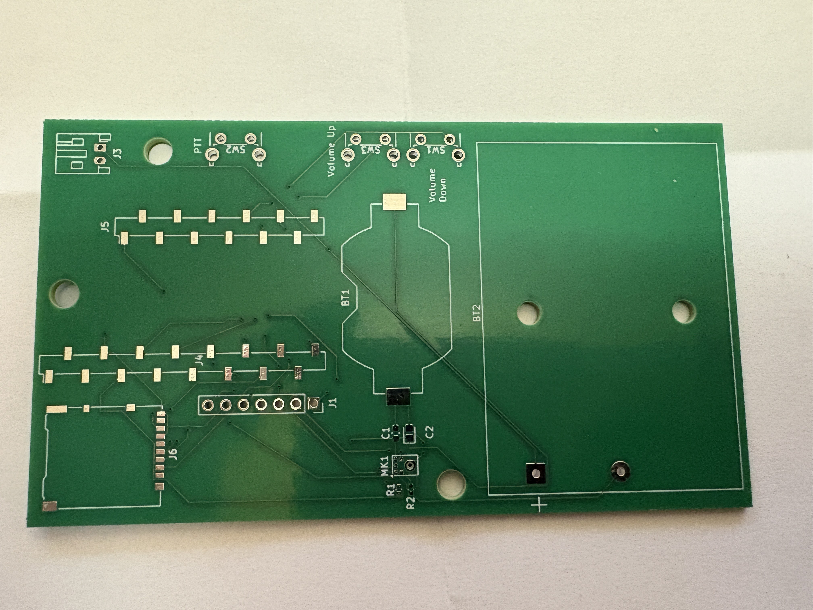
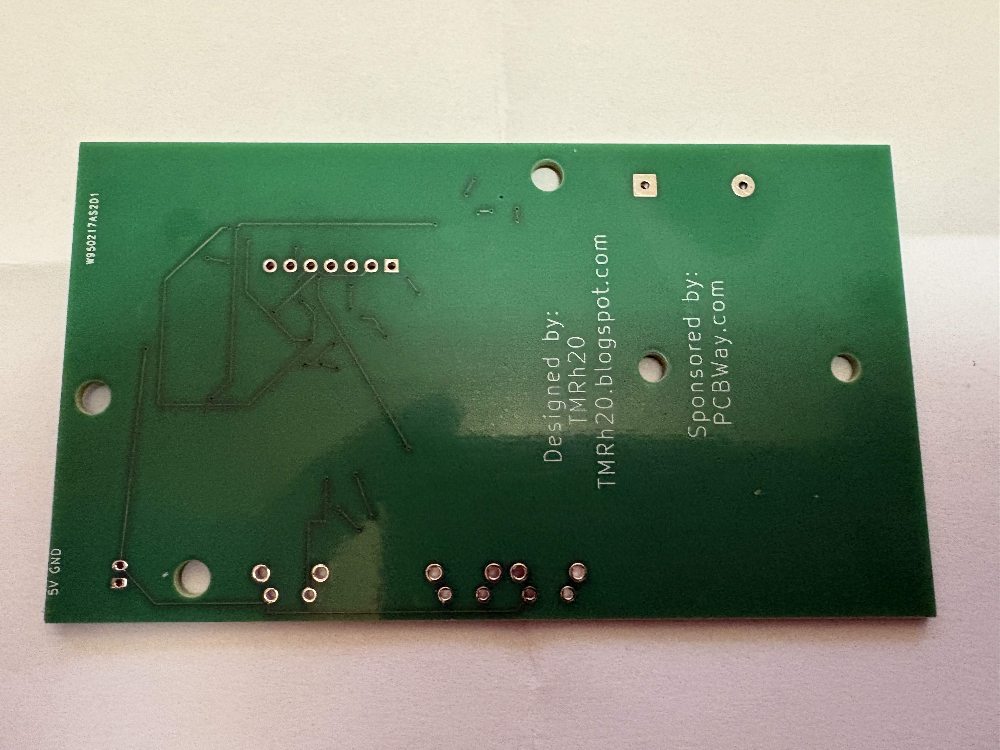
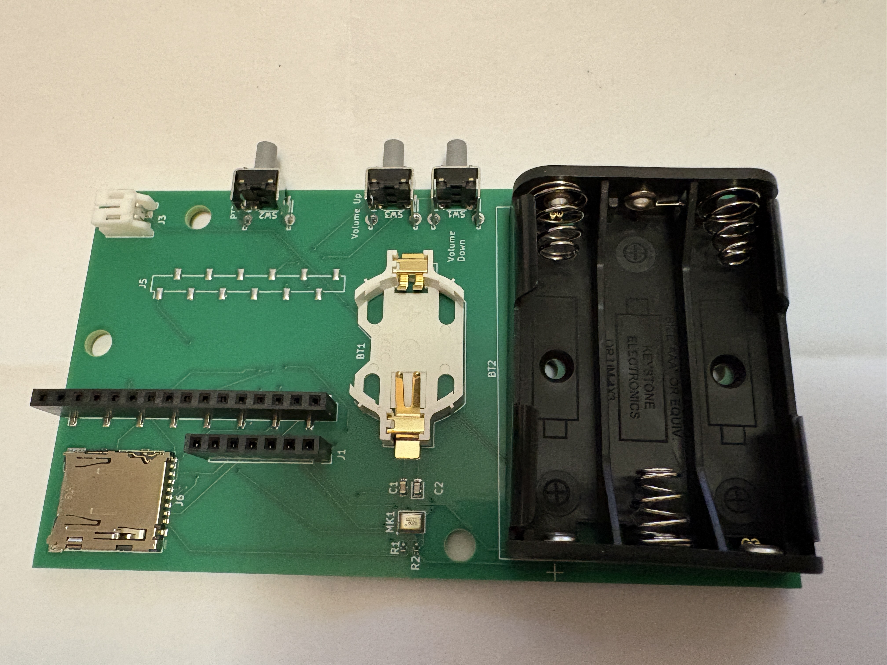
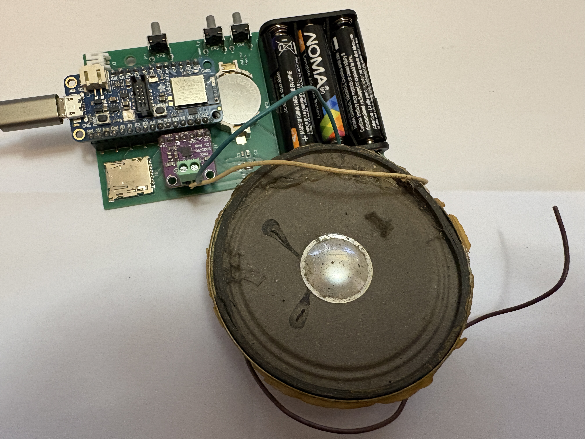

# FeatherAudio
Custom Circuit Board for Feather 52840

Designed by TMRh20, Sponsored by PCBWay.com

{width=50%, height=50%}

Requirements:
1 x Custom Circuit Board
1 x Feather 52840 based board (Feather 52840 Express, Feather 52840 Sense)
1 x Max98357A I2S Amplifier
2 x 4 to 8 Ohm Speaker
2 x 2032 3.3v Coin Battery
6 x AAA Battery
(Optional) 2 x Micro-SD Card

This custom circuit board was designed for basic prototyping via the AutoAnalogAudio library, however, it can be used
to create a custom walkie-talkie or intercom with range similar to BlueTooth.

{width=30%, height=30%}
{width=30%, height=30%}
{width=30%, height=30%}
{width=30%, height=30%}
